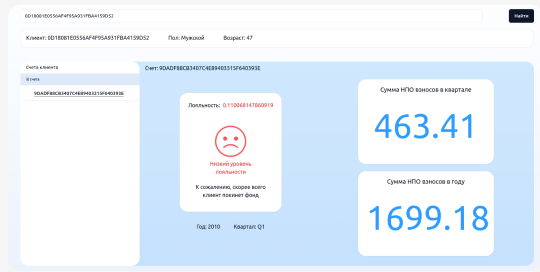
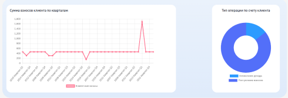

# MISIS Dark Horse

Исследование и прогнозирование динамики лояльности участников НПО

## Описание задачи

Исследование лояльности клиентов имеет большое значение для бизнеса, как с точки зрения сохранения текущей клиентской базы, так и с точки зрения привлечения новых клиентов. В контексте данного кейса лояльность клиентов НПФ можно определить, как вероятность сохранения действующего договора НПО на определенном временном интервале.

Предлагается разработать прототип сервиса прогнозирования динамики лояльности участников НПО на квартальном или годовом интервале на основе исторических данных о финансовых транзакциях по НПО-счетам и иных факторов.

# Наше решение

Мы представляем сервис, который помогает соотрудникам НПФ "Будущее" предсказывать отток клиентов, что позволит им проанализировать лояльность клиентов и вовремя предпринять необходимые меры. В основе работы сервиса лежит модель градиентного бустинга, **обученная на предобработанных и обогащенных новыми признаками данных.** В качестве новых признаков были использованы географические, экономические, статистические признаки. Например, центральная ставка и курс доллара по дате. Так же получены признаки, агреггированные по аккаунтам и кварталамна несколько записей назад. **Кроме того, модель в качестве признаков использует эмбеддинги, полученные при обучении автоэнкодера.**

Пользовательский интерфейс сервиса отображает статистику по каждому клиенту, а так же **предсказание уровня лояльности клиента на следующий квартал после последней записи по аккаунту.**

# Работа с данными

Были задействованы данные со стороны (курс доллара, ключевая ставка, средняя продолжительность жизни) Анализ этих данных позволяет понять экономическую и социальную ситуацию страны.
Также по почтовому индексу мы получаем координаты городов, округ проживания, что позволяет нам получать более глубокое представление месте жительства клиента.

blablabla все исследования
ссылка на файлик .ipymb

# Ml модель

[Подготовка тестового датасета для предиктов](<./ml/test-dataset(1).ipynb>)

[Предобработка и анализ тестовых данных](<./ml/data-preparation-hack-part-2%20(2).ipynb>)

[Получение весов ансабля моделей катбустов без эмбеддингов](./ml/ensembling-without-embeddings.ipynb)

# Сервис

_Репозиторий с фронтентом_ - https://github.com/anyhhope/npf-front

Cтек технологий:
Backend: Python, FastAPI
Frontend: React

Как запустить Backend:

cd backend
docker compose up --build -d
docker cp ./migrations backend-db-1:./migrations
docker exec -it backend-db-1 bash
psql -U pguser -d dev -a -f ./migrations/skript.sql
